<div align="center">

# 🛫 CramPilot

### Your AI Co-Pilot for Last-Minute Exam Rescue

[](https://reactjs.org/)
[](https://www.typescriptlang.org/)
[](https://vitejs.dev/)
[](https://ai.google.dev/)

*Turn exam panic into a strategic battle plan*

[Live Demo](https://cram-pilot.vercel.app/) • [Features](#-features) • [Quick Start](#-quick-start) • [How It Works](#-how-it-works)

---

### 🏆 Built for [SYNAPTIX - National Level AI Hackathon](https://unstop.com/p/synaptix-build-anything-w-gemini-national-online-hackathon-kalinga-institute-of-industrial-technology-kiit-bhubaneswar-1621881)
**Powered by Google Gemini** | Hosted by KIIT Bhubaneswar

| Team Name | Member |
|-----------|--------|
| **CLUELESS** 🧠 | **Nirmalya Ghosh** |

</div>

---

## 🚨 The Problem

Students face a brutal reality during exam season:
- **Time scarcity** — too much syllabus, too little time
- **Cognitive overload** — trying to learn everything leads to learning nothing
- **Stress paralysis** — anxiety blocks productivity
- **Generic schedules** — one-size-fits-all plans that ignore human inconsistency

---

## 💡 The Solution

**Academic Rescue Agent** is an AI-powered intervention system that doesn't just create schedules — it *strategically rescues* your exam preparation by:

| Feature | What It Does |
|---------|--------------|
| 🎯 **Priority Triage** | Identifies high-yield topics to maximize marks per hour |
| ✂️ **Strategic Skipping** | Tells you what to *not* study (and why) |
| 🧠 **Cognitive Load Balancing** | Alternates difficulty to prevent burnout |
| 📊 **Stress-Adaptive Planning** | Reduces workload when stress is high |
| 🔄 **Daily Adaptation** | Re-optimizes based on your actual progress |

---

## ✨ Features

### 📝 Smart Onboarding
- Input your exam date, subjects, and syllabus
- Rate your confidence level per subject (1-5)
- Specify available daily study hours
- Indicate current stress level

### 📅 Intelligent Schedule Generation
- Day-by-day task breakdown with effort ratings
- Strategic mix of study, review, practice, and breaks
- Daily checkpoints and stress management tips
- Pacing philosophy tailored to your situation

### 🔄 Adaptive Re-Planning
- Check in daily with completed tasks
- Report stress level changes
- AI regenerates the plan based on:
  - Missed tasks (dropped or condensed, not just pushed)
  - Stress increases (reduced difficulty for next 2 days)
  - Actual progress vs. expected progress

### 📊 Visual Dashboard
- Progress tracking with interactive charts
- Task completion interface
- Strategy overview panel
- Stress tips and motivation boosters

---

## 🚀 Quick Start

### Prerequisites
- [Node.js](https://nodejs.org/) (v18 or higher)
- [Gemini API Key](https://ai.google.dev/)

### Installation

```bash
# Clone the repository
git clone https://github.com/yourusername/academic-rescue-agent.git
cd academic-rescue-agent

# Install dependencies
npm install

# Set up environment variables
# Edit .env.local and add your Gemini API key
VITE_GEMINI_API_KEY=your_api_key_here

# Start the development server
npm run dev
```

The app will be available at `http://localhost:5173`

---

## 🧠 How It Works

```mermaid
flowchart LR
    A[📝 Input Profile] --> B[🤖 AI Analysis]
    B --> C[📅 Generate Plan]
    C --> D[✅ Execute Tasks]
    D --> E[📊 Daily Check-in]
    E --> F{Stress Changed?}
    F -- Yes --> G[🔄 Adapt Plan]
    F -- No --> D
    G --> D
```



### AI Reasoning Framework

The Gemini AI follows a specialized reasoning framework:

1. **Time Scarcity Analysis** — Calculates remaining days, identifies impossible coverage zones
2. **Cognitive Load Management** — Avoids consecutive high-effort tasks, inserts recovery
3. **Weakness-Priority Logic** — Focuses on low-confidence + high-impact topics
4. **Stress-Adaptive Planning** — High stress = reduced volume automatically
5. **Human Behavior Assumptions** — Accounts for procrastination and anxiety

---

## 🛠️ Tech Stack

| Technology | Purpose |
|------------|---------|
| **React 19** | UI framework with hooks |
| **TypeScript** | Type-safe development |
| **Vite** | Lightning-fast build tool |
| **Google Gemini AI** | Intelligent plan generation |
| **Recharts** | Progress visualization |
| **Lucide React** | Beautiful icons |
| **LocalStorage** | Data persistence |

---

## 📁 Project Structure

```
crampilot/
├── App.tsx                 # Main application component
├── types.ts                # TypeScript type definitions
├── components/
│   ├── Onboarding.tsx      # Initial setup wizard
│   ├── Dashboard.tsx       # Main study dashboard
│   └── TaskCard.tsx        # Individual task component
├── services/
│   └── gemini.ts           # Gemini AI integration
├── .env.local              # Environment variables
└── vite.config.ts          # Vite configuration
```

---

## 🔑 Environment Variables

| Variable | Description |
|----------|-------------|
| `VITE_GEMINI_API_KEY` | Your Google Gemini API key |

---

## 📸 Screenshots

<div align="center">
  <i>Coming soon...</i>
</div>

---

## 🤝 Contributing

Contributions are welcome! Please feel free to submit a Pull Request.

1. Fork the repository
2. Create your feature branch (`git checkout -b feature/AmazingFeature`)
3. Commit your changes (`git commit -m 'Add some AmazingFeature'`)
4. Push to the branch (`git push origin feature/AmazingFeature`)
5. Open a Pull Request

---

## 📄 License

This project is licensed under the MIT License - see the [LICENSE](LICENSE) file for details.

---

## 🙏 Acknowledgments

- Built with [Google Gemini AI](https://ai.google.dev/)
- Icons by [Lucide](https://lucide.dev/)
- Designed for students, by someone who understands exam stress

---

<div align="center">

**CramPilot** — Made with ❤️ for stressed students everywhere

*"When the syllabus is infinite but time isn't — we've got your back."*

</div>
